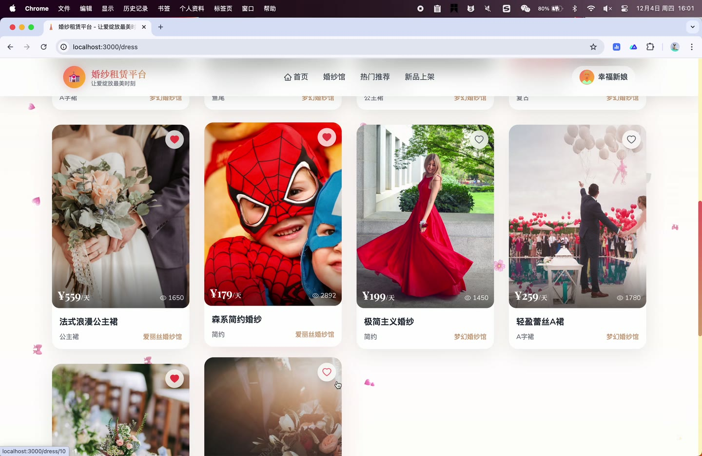
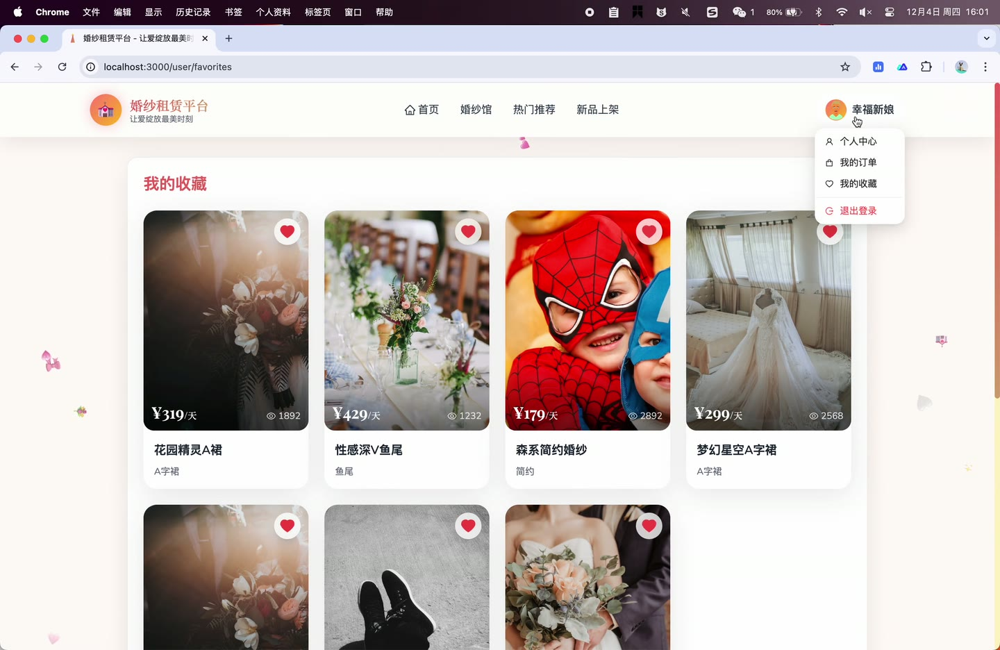
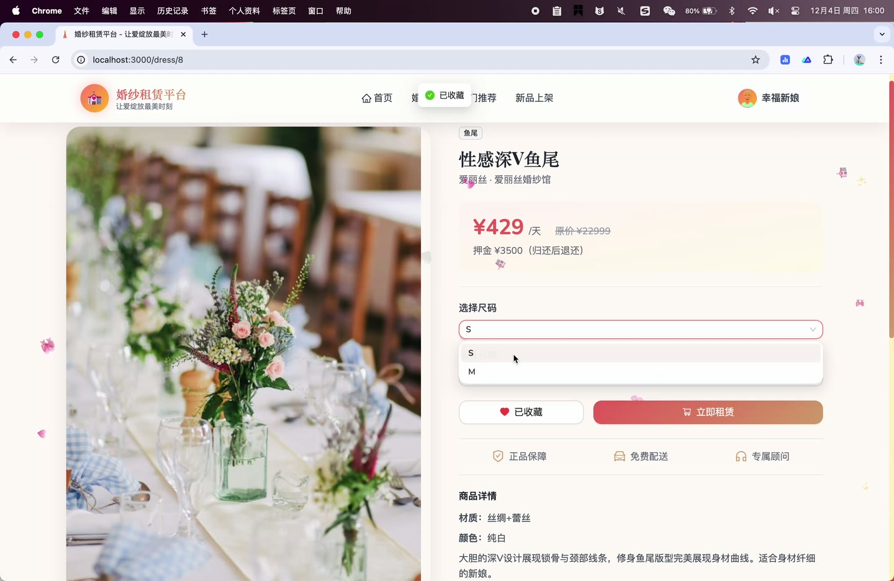
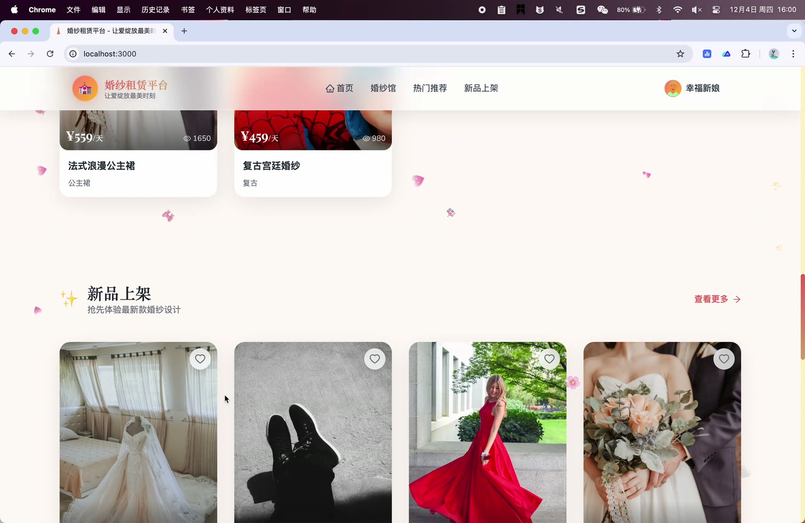
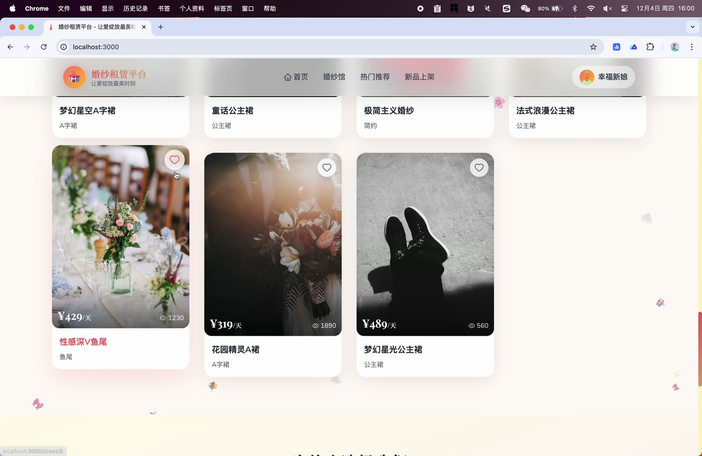
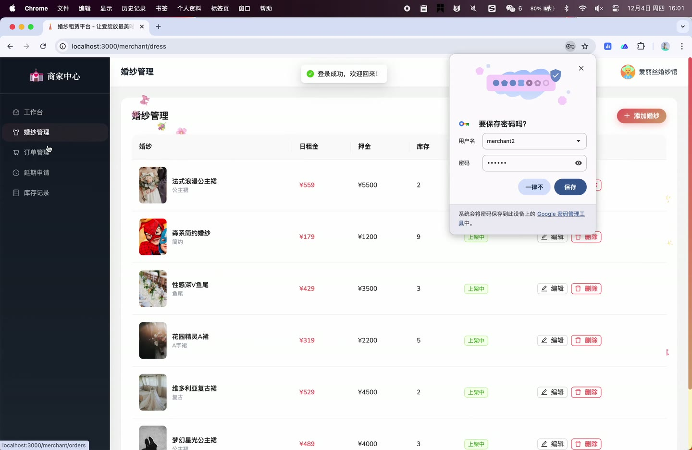

# (附文档)Springboot3+Vue3+MySQL 婚纱租赁系统

**技术栈**：Springboot3、Vue3、MySQL

### 系统简介

本系统是一个基于 Spring Boot 3 + Vue 3 前后端分离的婚纱租赁平台。系统支持普通用户在线浏览婚纱、下单租赁、在线咨询；商家入驻并管理自有婚纱与订单；平台管理员进行全站用户、商家、订单、内容及系统配置的集中管理。系统内置客服聊天、延期申请、异常订单处理、数据备份恢复等完整业务闭环。
 
### 核心功能
 
### 普通用户端

 
- 注册/登录：支持用户名密码注册与登录，自动校验用户名唯一性，密码经 MD5 加密后存储。 
- 浏览婚纱列表：按分类、风格、价格区间、尺码、关键字筛选，分页展示已上架婚纱。 
- 查看婚纱详情：展示封面图与多张详情图轮播，显示材质、颜色、品牌、商家名称、日租金、押金、库存。 
- 收藏/取消收藏：在详情页一键切换收藏状态，收藏列表页可查看所有已收藏婚纱。 
- 租赁下单：选择尺码、起止日期，系统自动计算天数与总价（租金+押金），填写收货信息后提交订单。 
- 支付订单：对已创建订单进行支付操作，传入支付方式字段。 
- 取消订单：可填写取消原因后取消未支付的订单。 
- 评价订单：对已完成的订单进行评分、填写文字评价并上传评价图片。 
- 申请延期：对租赁中的订单提交延期申请，填写延期天数和原因。 
- 查看订单列表：按状态筛选查看个人订单，点击可查看订单详情。 
- 查看我的延期申请：查看所有延期申请记录及其审批状态。 
- 个人中心：查看和修改个人信息（昵称、头像等），修改登录密码。 
- 申请成为商家：填写商家入驻信息（店铺名称、Logo、联系方式等），提交后等待管理员审核。 
- 查看商家申请状态：查询当前入驻申请的审核进度。 
- 客服聊天：与商家创建/获取聊天会话，发送文本消息，查看历史消息，标记消息已读，查看未读消息数。
 
### 商家端

 
- 查看/编辑商家信息：查看并更新店铺信息（店铺名称、Logo、联系电话、地址等）。 
- 管理自有婚纱：查看本店婚纱列表（支持按状态/关键字筛选），新增婚纱（提交后进入待审核状态），编辑、删除、上下架自有婚纱。 
- 查看本店订单：按状态/订单号筛选查看订单列表，查看订单详情。 
- 确认发货：对已支付的订单执行确认发货操作。 
- 确认归还：对已发货的订单执行确认归还操作。 
- 标记异常订单：对订单标记为损坏或逾期异常，填写备注说明。 
- 回复评价：对用户提交的评价进行回复。 
- 查看统计：查看本店订单相关的统计数据。 
- 管理延期申请：查看用户提交的延期申请列表，批准或拒绝延期申请（拒绝时填写原因）。 
- 库存变动记录：查看本店所有婚纱的库存变动流水（含变动类型、变动数量、变动前后库存、操作人）。 
- 手动调整库存：对指定婚纱发起入库/出库等库存调整操作，系统自动记录流水并更新库存。 
- 客服聊天：查看与本店关联的用户会话列表，发送/接收消息，标记已读，查看未读消息数。
 
### 管理员端

 
- 用户管理：查看用户列表（支持按用户名/角色关键字搜索），新增用户，编辑用户信息，启用/禁用用户，删除用户，查看用户详情与历史订单。 
- 商家管理：查看商家入驻申请列表，审核商家入驻（通过/拒绝），管理已入驻商家。 
- 婚纱管理：查看全站婚纱列表（按状态/关键字筛选），审核商家发布的婚纱（通过/拒绝），上下架任意婚纱，编辑婚纱信息，删除婚纱。 
- 订单管理：查看全站订单列表（按状态/订单号筛选），处理用户退款申请（同意/拒绝并填写备注），标记异常订单（损坏/逾期），解决异常订单。 
- 分类管理：添加、编辑、删除婚纱分类（支持多级分类树结构）。 
- 轮播图管理：查看轮播图列表，添加、编辑、删除首页轮播图（含标题、图片、链接、排序）。 
- 系统配置：查看所有系统配置项，新增/编辑配置（键、值、描述），删除配置。 
- 操作日志：查看系统操作日志列表（按操作人/操作类型筛选）。 
- 数据备份：查看备份列表，手动创建数据库备份（可填写备注），恢复指定备份，下载备份文件，删除备份。 
- 数据统计：查看全站订单相关的统计数据。
 
### 技术栈

 后端框架Spring Boot 3 ORMMyBatis-Plus 权限认证JWT（自定义拦截器） 前端框架Vue 3 UI 组件库Ant Design Vue 状态管理Pinia 构建工具Vite 数据库MySQL 数据库连接池HikariCP
 
### 交付内容

 
- 后端完整源码 
- 前端完整源码 
- 数据库初始化脚本 
- 万字文档

## 界面展示

---

## 获取完整源码 + 万字文档

本仓库为项目介绍页。**完整前后端源码、数据库初始化脚本、万字项目文档**，请访问 [codekk.top](http://codekk.top) 获取。

可作课程设计 / 毕业设计参考，支持远程部署调试。